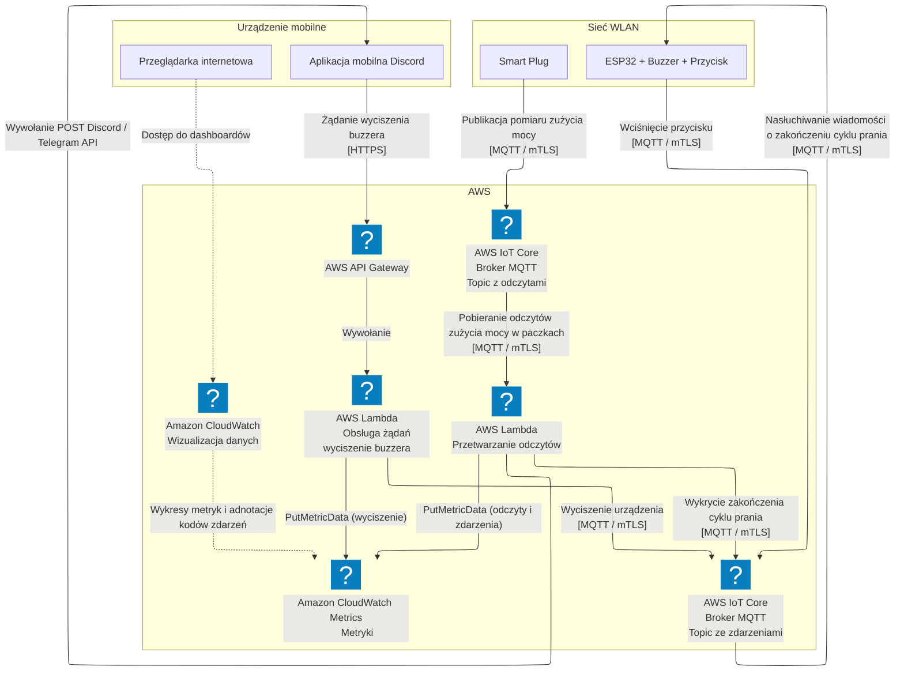
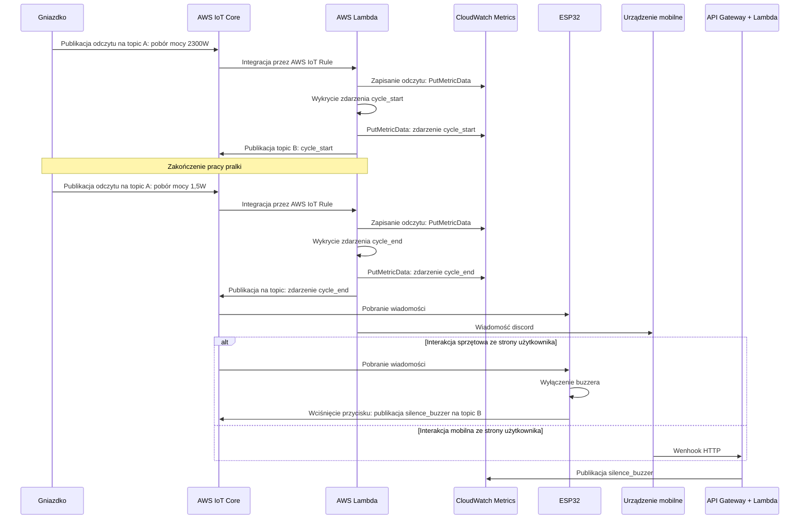

# System IoT monitorujący pracę pralki

Sieci czujnikowe i internetu rzeczy  
Realizacja 2026L  
Autorzy: Krzysztof Fijałkowski, Tomasz Owienko

# Cel projektu

Celem projektu jest implementacja systemu monitorowania cyklu pracy pralki oraz powiadamiania o jego zakończeniu za pomocą mikrokontrolera ESP32, inteligentnego gniazdka oraz chmury AWS.

# Działanie systemu

- Inteligentne gniazdko mierzy zużycie energii przez pralkę i wysyła je na topic MQTT (A) w chmurze AWS  
- Funkcja serverless pobiera wiadomości MQTT w paczkach i zapisuje je do niestandardowych metryk CloudWatch  
  - Gdy zużycie energii wzrasta, jest to rejestrowane jako rozpoczęcie cyklu prania  
  - Gdy zużycie energii spadnie na określony czas (np. 3 minuty), jest to rejestrowane jako zakończenie cyklu prania  
- W momencie rozpoczęcia / zakończenia cyklu, funkcja publikuje wiadomość na innym topicu (B)  
- Wiadomość jest odbierana przez urządzenie ESP32 wyposażone w buzzer i przycisk; buzzer zaczyna wydawać dźwięk  
- Jednocześnie na telefon z systemem Android wysyłane jest powiadomienie push  
- Naciśnięcie przycisku lub kliknięcie powiadomienia push przez użytkownika powoduje opublikowanie wiadomości na topicu (B)  
- ESP32 odbiera wiadomość z topicu B i wyłącza buzzer  
- W dowolnym momencie powinna istnieć możliwość podglądu surowych odczytów z inteligentnego gniazdka oraz wykrytych zdarzeń (rozpoczęcie cyklu, zakończenie cyklu, wyciszenie brzęczyka) za pośrednictwem interfejsu webowego lub aplikacji mobilnej

# Wybrane czujniki

- Seeed Xiao ESP32-S3 \- WiFi/Bluetooth \- Seeedstudio 113991114  
- Moduł z buzzerem aktywnym z generatorem \- SENV0005  
- Tact Switch 12x12mm \- przyciski kolorowe \- 4szt. \- SparkFun PRT-14460  
- Zestaw płytka stykowa 830 \+ przewody \+ moduł zasilający  
- Zestaw rezystorów CF THT 1/4W opisany \- 160szt.  
- Zasilacz impulsowy 5V/3A 15W \- wtyk DC 5,5/2,1mm  
- Shelly Plug S Gen3 \- inteligentne gniazdko WiFi/Bluetooth/Matter z pomiarem energii \- białe
  - Gniazdko ma możliwość pracy jako publisher MQTT  

# Architektura rozwiązania

## Schemat połączeń

## Wykorzystane usługi chmurowe

- AWS IoT Core: broker MQTT, wspiera mTLS i może wywoływać funkcje AWS Lambda.  
- AWS Lambda: Zapewnia środowisko uruchomieniowe dla zdefiniowanej logiki biznesowej w chmurze  
- Amazon CloudWatch Metrics: przechowuje szeregi czasowe odczytów i zdarzeń jako metryki 
- AWS API Gateway: obsługuje żądania wyciszenia buzzera wysłane z telefonu  
- Amazon CloudWatch Dashboards: wizualizuje szeregi czasowe, dostęp nie wymaga logowania do konta AWS

## Schemat komunikacji

## Przepływ komunikacji

# Konfiguracja czujników i warstwy sieciowej

**TODO KF**

## Konfiguracja wtyczki

Używając aplikacji shelly konfigurujemy wtyczkę wybierając opcję dodania urządzenia:  

Następnie w ustawieniach tej wtyczki mamy możliwość ustawienia serwera MQTT  

## Konfiguracja płytki i środowiska

Konfiguracja zaczęła się instalacją i ustawieniem oprogramowania Arduino IDE oraz zainstalowanie w nim biblioteki esp32  

Następnie skonfigurowanie odpowiedniej płytki i portu na którym jest podłączona  

Ostatnim krokiem było napisanie odpowiedniego kodu programu jak i go wgranie.

- Działający układ z przykładowym programem (naciśnięcie przycisku powoduje zmian stanu brzęczyka)  
  - nagranie: [https://photos.app.goo.gl/jPcqguUSQTLhYxKf7](https://photos.app.goo.gl/jPcqguUSQTLhYxKf7)  
- Działająca wtyczka pobiera aktualne dane

# Przesyłanie i integracja danych w chmurze

## Broker MQTT

Rolę brokera MQTT w systemie pełni usługa AWS IoT Core, zapewniająca szyfrowaną komunikację przy użyciu certyfikatów mTLS. Właściwy broker MQTT jest niewidoczny, usługa AWS IoT core zapewnia jedyne abstrakcję topiców i sama odpowiada za właściwą obsługę przekazywania wiadomości. Gniazdko ma uprawnienia wyłącznie do publikacji na zdefiniowanym topicu z pomiarami mocy układu. ESP32 ma możliwość publikowania, subskrypcji i nasłuchiwania wiadomości wyłącznie na topicu zdarzeń, służącym do obsługi i sterowania pracą buzzera.

## Zapis szeregów czasowych

Zgromadzone dane pomiarowe oraz wygenerowane informacje o stanie cyklu pralki przechowywane są jako zbiór szeregów czasowych w usłudze Amazon CloudWatch Metrics. Jest to poniekąd rozwiązanie kompromisowe -- usługa ta nie jest co do zasady bazą danych szeregów czasowych. Pierwotny plan zakładał wykorzystanie usługi AWS Timestream for LiveAnalytics jako taniej (serverless) bazy danych, jednak wsparcie dla niej jest ograniczone i nie jest ona dostępna na nowych kontach AWS. Dostawca sugeruje wykorzystanie AWS Timestream for InfluxDB, jednak w tej usłudze należy opłacać faktyczny serwer, na którym uruchomiona jest baza danych. AWS Cloudwatch Metrics wspiera wszystkie operacje na szeregach czasowych wymagane przez projekt i jest efektywny kosztowo, co zadecydowało o jego wyborze.

## Przetwarzanie szeregów czasowych

Do przetwarzania danych wykorzystano usługę AWS Lambda zapewniającą kosztowo efektywne przetwarzanie z łatwą integracją IoT Core. Utworzono dwie funkcje (Python 3.12):

- 1. `processor` - przetwarza pomiary, wykrywa zdarzenia rozpoczęcia i zakończenia cyklu prania i reaguje na nie
- 2. `webhook` - obsługuje żądania wyciszenia buzzera.

Pierwsza z funkcji pobiera nowe pomiary i zapisuje je jako metryki. Następnie analizuje wszystkie pomiary w zadanym oknie czasowym i wykrywa nagłe skoki poboru mocy powyżej i poniżej progu (10W). W przypadku wystąpienia skoku publikowane jest zdarzenie `cycle_start` bądź `cycle_end` w AWS Cloudwatch Metrics, dodatkowo w przypadku `cycle_end` publikowana jest wiadomość na osobnym topicu MQTT, który jest subskrybowany przez ESP32. Aby nie wywoływać funkcji z każdym odczytem dane są buforowane w kolejce AWS SQS, skąd Lambda pobiera je w paczkach.

Druga z funkcji jest wywoływana w momencie otrzymania żądania HTTP nakazującego wyciszyć buzzer w usłudze AWS API Gateway. Funkcja rejestruje to zdarzenie w Cloudwatch i publikuje stosowną wiadomość na topicu subskrybowanym przez ESP32.
