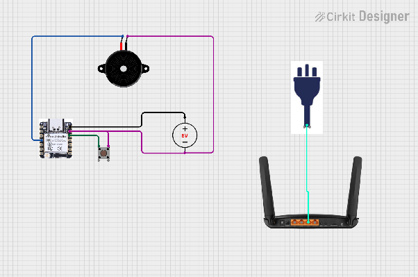
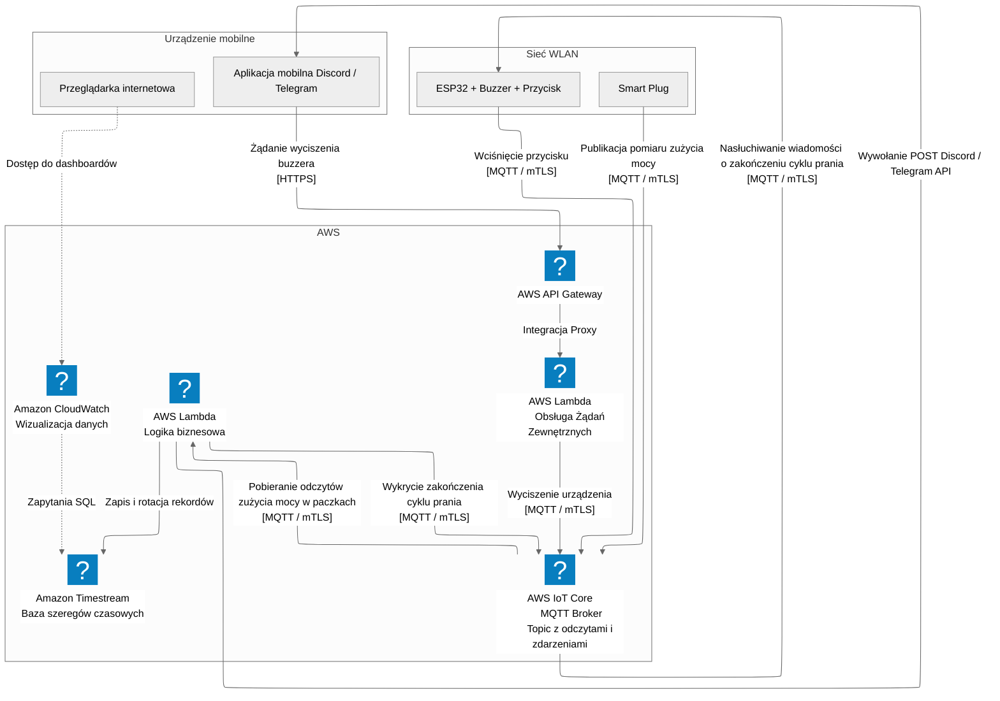
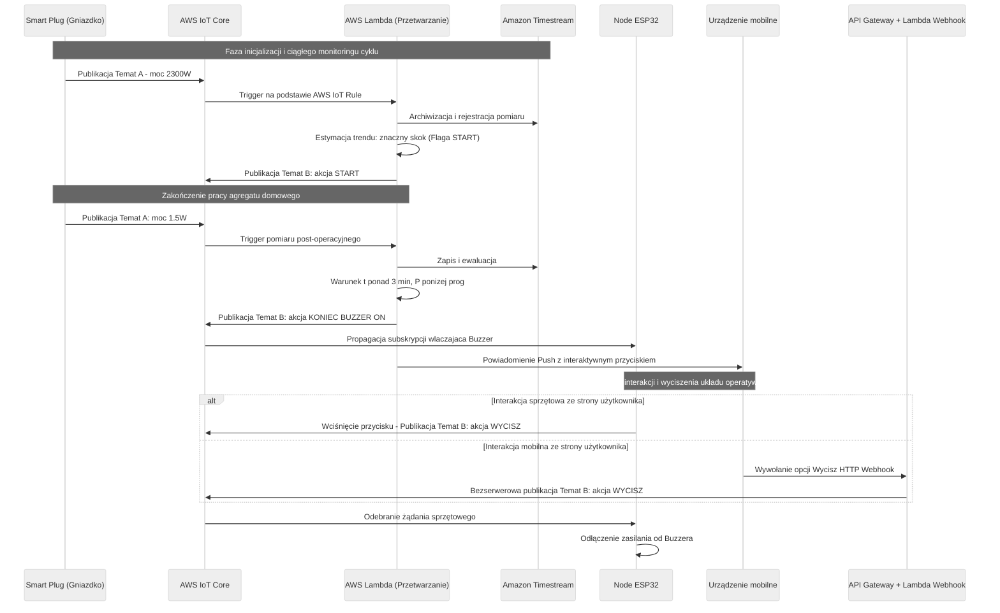
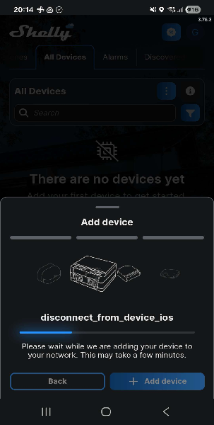
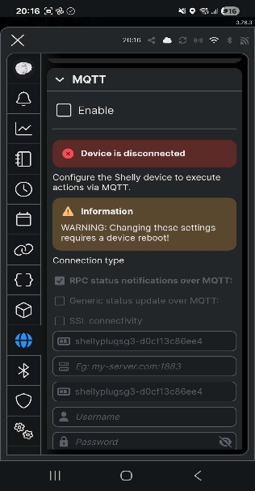
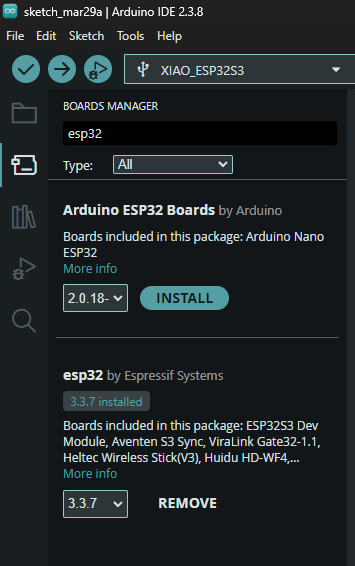
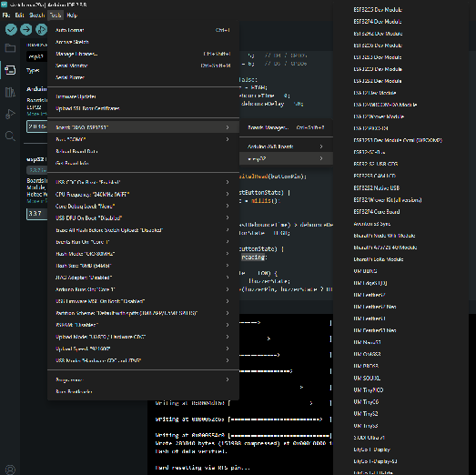
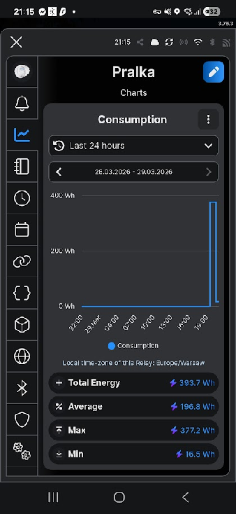

# System IoT monitorujący pracę pralki

Sieci czujnikowe i internetu rzeczy  
Realizacja 2026L  
Autorzy: Krzysztof Fijałkowski, Tomasz Owienko

# Cel projektu

Celem projektu jest implementacja systemu monitorowania cyklu pracy pralki oraz powiadamiania o jego zakończeniu za pomocą mikrokontrolera ESP32, inteligentnego gniazdka oraz chmury AWS.

# Działanie systemu

- Inteligentne gniazdko mierzy zużycie energii przez pralkę i wysyła je na topic MQTT (A) w chmurze AWS  
- Funkcja serverless pobiera wiadomości MQTT w paczkach i zapisuje je do bazy danych szeregów czasowych  
  - Gdy zużycie energii wzrasta, jest to rejestrowane jako rozpoczęcie cyklu prania  
  - Gdy zużycie energii spadnie na określony czas (np. 3 minuty), jest to rejestrowane jako zakończenie cyklu prania  
- W momencie rozpoczęcia / zakończenia cyklu, funkcja publikuje wiadomość na innym topicu (B)  
- Wiadomość jest odbierana przez urządzenie ESP32 wyposażone w buzzer i przycisk; buzzer zaczyna wydawać dźwięk  
- Jednocześnie na telefon z systemem Android wysyłane jest powiadomienie push  
- Naciśnięcie przycisku lub kliknięcie powiadomienia push przez użytkownika powoduje opublikowanie wiadomości na topicu (B)  
- ESP32 odbiera wiadomość z topicu B i wyłącza buzzer  
- W dowolnym momencie powinna istnieć możliwość podglądu surowych odczytów z inteligentnego gniazdka oraz wykrytych zdarzeń (rozpoczęcie cyklu, zakończenie cyklu, wyciszenie brzęczyka) za pośrednictwem interfejsu webowego lub aplikacji mobilnej

# Wybrane czujniki

- Seeed Xiao ESP32-S3 \- WiFi/Bluetooth \- Seeedstudio 113991114  
  - Gniazdko ma możliwość pracy jako publisher MQTT  
- Moduł z buzzerem aktywnym z generatorem \- SENV0005  
- Tact Switch 12x12mm \- przyciski kolorowe \- 4szt. \- SparkFun PRT-14460  
- Zestaw płytka stykowa 830 \+ przewody \+ moduł zasilający  
- Zestaw rezystorów CF THT 1/4W opisany \- 160szt.  
- Zasilacz impulsowy 5V/3A 15W \- wtyk DC 5,5/2,1mm  
- Shelly Plug S Gen3 \- inteligentne gniazdko WiFi/Bluetooth/Matter z pomiarem energii \- białe

# Architektura rozwiązania

## Schemat połączeń

## Wykorzystane usługi chmurowe

- AWS IoT Core: broker MQTT, wspiera mTLS i może wywoływać funkcje AWS Lambda.  
- Amazon Timestream: baza danych przeznaczona do szeregów czasowych  
- AWS Lambda: Zapewnia środowisko uruchomieniowe dla zdefiniowanej logiki biznesowej w chmurze  
- AWS API Gateway: obsługuje żądania wyciszenia buzzera wysłanego z telefonu  
- Amazon CloudWatch Dashboards: wizualizuje szeregi czasowe, dostęp nie wymaga logowania do konta AWS

## Schemat komunikacji

## Przepływ komunikacji

# Konfiguracje

## Konfiguracja wtyczki

Używając aplikacji shelly konfigurujemy wtyczkę wybierając opcję dodania urządzenia:  

Następnie w ustawieniach tej wtyczki mamy możliwość ustawienia serwera MQTT  

## Konfiguracja płytki i środowiska

Konfiguracja zaczęła się instalacją i ustawieniem oprogramowania Arduino IDE oraz zainstalowanie w nim biblioteki esp32  

Następnie skonfigurowanie odpowiedniej płytki i portu na którym jest podłączona  

Ostatnim krokiem było napisanie odpowiedniego kodu programu jak i go wgranie.

# Aktualny stan projektu:

- Działający układ z przykładowym programem (naciśnięcie przycisku powoduje zmian stanu brzęczyka)  
  - nagranie: [https://photos.app.goo.gl/jPcqguUSQTLhYxKf7](https://photos.app.goo.gl/jPcqguUSQTLhYxKf7)  
- Działająca wtyczka pobiera aktualne dane

