# Cel projektu

Celem projektu jest implementacja systemu monitorowania cyklu pracy pralki oraz powiadamiania o jego zakończeniu za pomocą mikrokontrolera ESP32, inteligentnego gniazdka oraz chmury AWS.

# Działanie systemu

- Inteligentne gniazdko mierzy zużycie energii przez pralkę i wysyła je na topic MQTT (A) w chmurze AWS  
- Funkcja serverless pobiera wiadomości MQTT w paczkach i zapisuje je do niestandardowych metryk CloudWatch  
  - Gdy zużycie energii wzrasta, jest to rejestrowane jako rozpoczęcie cyklu prania  
  - Gdy zużycie energii utrzymuje się poniżej progu przez określony czas (2 minuty), rejestrowane jest zakończenie cyklu prania
- W momencie rozpoczęcia lub zakończenia cyklu funkcja publikuje wiadomość na topicu zdarzeń (B)  
- Po zakończeniu cyklu wiadomość dociera do urządzenia ESP32 wyposażonego w buzzer i przycisk; buzzer zaczyna wydawać dźwięk  
- Jednocześnie na telefon z systemem Android wysyłane jest powiadomienie push  
- Naciśnięcie przycisku lub kliknięcie powiadomienia push przez użytkownika powoduje opublikowanie wiadomości na topicu (B)  
- ESP32 odbiera wiadomość z topicu B i wyłącza buzzer  
- W dowolnym momencie powinna istnieć możliwość podglądu surowych odczytów z inteligentnego gniazdka oraz wykrytych zdarzeń (rozpoczęcie cyklu, zakończenie cyklu, wyciszenie buzzera) za pośrednictwem interfejsu webowego lub aplikacji mobilnej

# Wybrane czujniki

- Seeed Xiao ESP32-S3  WiFi/Bluetooth  Seeedstudio 113991114  
- Moduł z buzzerem aktywnym z generatorem  SENV0005  
- Tact Switch 12x12mm  przyciski kolorowe  4szt.  SparkFun PRT-14460  
- Zestaw płytka stykowa 830  przewody  moduł zasilający  
- Zestaw rezystorów CF THT 1/4W opisany  160szt.  
- Zasilacz impulsowy 5V/3A 15W  wtyk DC 5,5/2,1mm  
- Shelly Plug S Gen3  inteligentne gniazdko WiFi/Bluetooth/Matter z pomiarem energii  białe
  - Gniazdko ma możliwość pracy jako publisher MQTT

# Architektura rozwiązania

## Schemat połączeń płytki

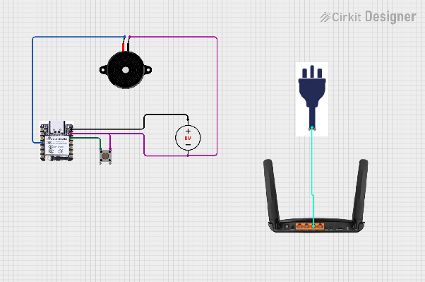{ width=60% }

## Wykorzystane usługi chmurowe

Ponieważ system przeznaczony jest do faktycznego wykorzystania po zakończeniu realizacji projektu, kluczowym kryterium w projektowaniu architektury było ograniczenie kosztów działania. Miało ono kluczowe znaczenie przy wyborze usług AWS: system korzysta jedynie z usług serverless rozliczanych wg faktycznego wykorzystania, co pozwala zminimalizować koszty.

- AWS IoT Core: broker MQTT, wspiera mTLS i może wywoływać funkcje AWS Lambda.  
- AWS Lambda: Zapewnia środowisko uruchomieniowe dla zdefiniowanej logiki biznesowej w chmurze  
- Amazon CloudWatch Metrics: przechowuje szeregi czasowe odczytów i zdarzeń jako metryki 
- AWS API Gateway: obsługuje żądania wyciszenia buzzera wysłane z telefonu  
- Amazon CloudWatch Dashboards: wizualizuje szeregi czasowe; dostęp z konsoli AWS lub przez opcjonalny link publiczny udostępniony z poziomu konsoli

## Schemat komunikacji

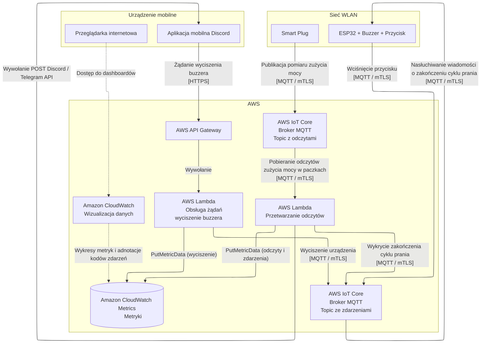
```mermaid
---
config:
  layout: elk
---
flowchart TD
    subgraph WLAN [Sieć WLAN]
        gniazdko[Smart Plug]
        esp[ESP32 + Buzzer + Przycisk]
    end
    
    subgraph AWS [AWS]
        iot-readings[AWS IoT Core
        Broker MQTT
        Topic z odczytami]
        iot-readings
        iot-events[AWS IoT Core
        Broker MQTT
        Topic ze zdarzeniami]
        iot-events
        lambda_proc[AWS Lambda
        Przetwarzanie odczytów]
        lambda_proc
        metrics[(Amazon CloudWatch Metrics
        Metryki)]
        metrics
        lambda_webhook[AWS Lambda
        Obsługa żądań wyciszenie buzzera]
        lambda_webhook
        api[AWS API Gateway]
        api
        cloudwatch[Amazon CloudWatch
        Wizualizacja danych]
        cloudwatch
    end
    
    subgraph APKA [Urządzenie mobilne]
        phone[Aplikacja mobilna Discord ]
        phone_web[Przeglądarka internetowa]
    end

    gniazdko -- Publikacja pomiaru zużycia mocy<br>[MQTT / mTLS] --> iot-readings
    iot-readings -- Pobieranie odczytów zużycia mocy w paczkach<br>[MQTT / mTLS] --> lambda_proc
    lambda_proc -- PutMetricData (odczyty i zdarzenia) --> metrics
    lambda_webhook -- PutMetricData (wyciszenie) --> metrics
    lambda_proc -- Wykrycie zakończenia cyklu prania<br>[MQTT / mTLS] --> iot-events
    
    iot-events -- Nasłuchiwanie wiadomości o zakończeniu cyklu prania<br>[MQTT / mTLS] --> esp
    esp -- Wciśnięcie przycisku<br>[MQTT / mTLS] --> iot-events
    
    lambda_proc -- Wywołanie POST Discord / Telegram API --> phone
    phone -- Żądanie wyciszenia buzzera<br>[HTTPS] --> api
    api -- Wywołanie --> lambda_webhook
    lambda_webhook -- Wyciszenie urządzenia<br>[MQTT / mTLS] --> iot-events
    
    cloudwatch -. "Wykresy metryk i adnotacje kodów zdarzeń" .-> metrics
    phone_web -. "Dostęp do dashboardów" .-> cloudwatch
```

## Przepływ komunikacji

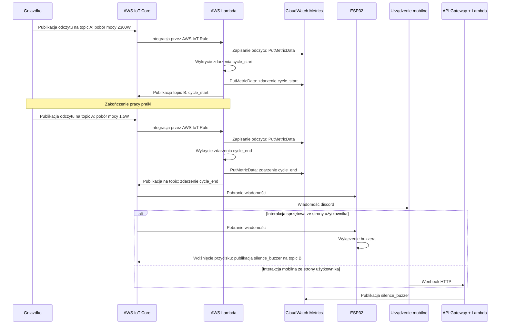
```mermaid
---
config:
  layout: elk
  <!-- theme: neutral -->
---
sequenceDiagram
    participant Plug as Gniazdko
    participant IoT as AWS IoT Core
    participant Lambda as AWS Lambda
    participant CWM as CloudWatch Metrics
    participant ESP as ESP32 
    participant Phone as Urządzenie mobilne
    participant API as API Gateway + Lambda

    Plug->>IoT: Publikacja odczytu na topic A: pobór mocy 2300W
    IoT->>Lambda: Integracja przez AWS IoT Rule
    Lambda->>CWM: Zapisanie odczytu: PutMetricData
    Lambda->>Lambda: Wykrycie zdarzenia cycle_start
    Lambda->>CWM: PutMetricData: zdarzenie cycle_start
    Lambda->>IoT: Publikacja topic B: cycle_start

    Note over Plug, Lambda: Zakończenie pracy pralki
    Plug->>IoT: Publikacja odczytu na topic A: pobór mocy 1,5W
    IoT->>Lambda: Integracja przez AWS IoT Rule
    Lambda->>CWM: Zapisanie odczytu: PutMetricData
    Lambda->>Lambda: Wykrycie zdarzenia cycle_end
    
    Lambda->>CWM: PutMetricData: zdarzenie cycle_end
    Lambda->>IoT: Publikacja na topic: zdarzenie cycle_end
    IoT->>ESP: Pobranie wiadomości
    Lambda->>Phone: Wiadomość discord
    
    alt Interakcja sprzętowa ze strony użytkownika
        IoT->>ESP: Pobranie wiadomości
        ESP->>ESP: Wyłączenie buzzera
        ESP->>IoT: Wciśnięcie przycisku: publikacja silence_buzzer na topic B
    else Interakcja mobilna ze strony użytkownika
        Phone->>API: Wenhook HTTP
    end

    API->>CWM: Publikacja silence_buzzer
```


# Konfiguracja czujników i warstwy sieciowej

## Pobranie materiału kryptograficznego

Certyfikaty są generowane jednorazowo przez Terragrunt w module [`cloud/modules/iot-core`](../cloud/modules/iot-core/main.tf) i udostępniane jako wrażliwe outputy.

```bash
cd cloud/environments/prod/iot

AWS_PROFILE=terraform terragrunt output -raw iot_data_endpoint     # host MQTT
AWS_PROFILE=terraform terragrunt output -raw esp_certificate_pem    # cert ESP32
AWS_PROFILE=terraform terragrunt output -raw esp_private_key        # klucz ESP32
AWS_PROFILE=terraform terragrunt output -raw shelly_certificate_pem # cert Shelly
AWS_PROFILE=terraform terragrunt output -raw shelly_private_key     # klucz Shelly

curl -sSf https://www.amazontrust.com/repository/AmazonRootCA1.pem
```


## Konfiguracja wtyczki Shelly Plug S Gen3

Używając aplikacji Shelly konfigurujemy wtyczkę wybierając opcję dodania urządzenia:  

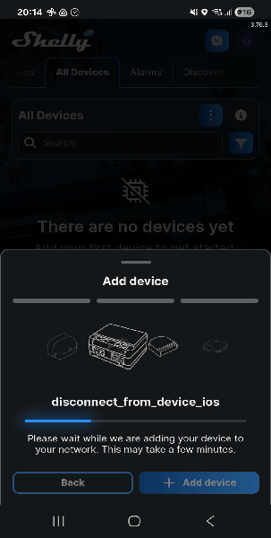{ width=30% }

W ustawieniach wtyczki (sekcja MQTT) wprowadzamy parametry połączenia z AWS IoT Core:

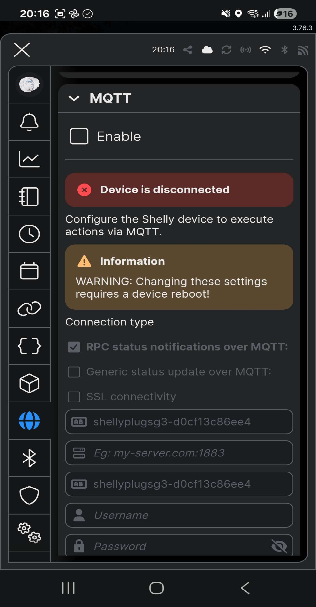{ width=30% }

| Parametr | Wartość |
| -------- | --------------------------- |
| Enable MQTT | włączone |
| Server | `<iot_data_endpoint>:8883` (wartość z `terragrunt output -raw iot_data_endpoint`) |
| Client ID | `scir-prod-shelly-plug` (musi być identyczny z nazwą IoT Thing) |
| MQTT prefix | `scir/prod/washer/shelly-plug/status/switch:0` |
| Enable SSL / TLS | włączone |
| CA certificate | `*` (cert AWS-a był już dostępny na wtyczce więc nie było wymagania aby wgrywać go ręcznie) |
| Username | taki sam jak client id |
| Password | Wyjęte z sekretów terragrunt |

Po zapisaniu i restarcie wtyczki w panelu CloudWatch (dashboard z modułu [`cloud/modules/observability`](../cloud/modules/observability/main.tf)) powinny pojawić się punkty metryki `SCIR/Washer / WasherPowerReading`.

## Konfiguracja płytki i środowiska

Konfiguracja zaczęła się instalacją i ustawieniem oprogramowania Arduino IDE oraz zainstalowanie w nim biblioteki esp32:

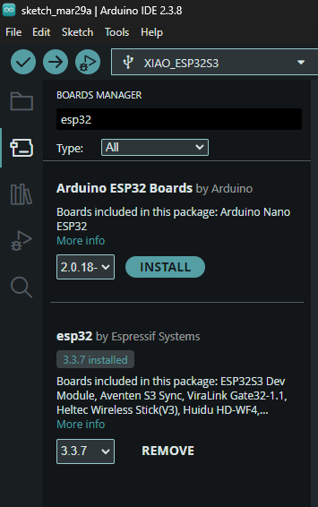{ width=30% }

Następnie skonfigurowanie odpowiedniej płytki (`XIAO_ESP32S3`) i portu na którym jest podłączona:

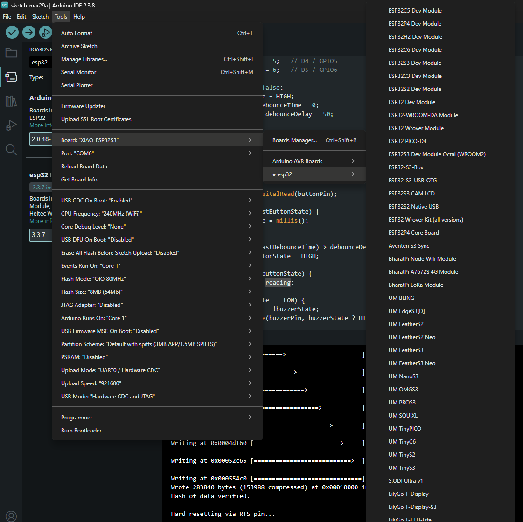{ width=60% }

Firmware znajduje się w katalogu [`device/esp32-buzzer/`](../device/esp32-buzzer/) i składa się z trzech plików: szkicu Arduino `esp32-buzzer.ino`, szablonu `secrets.h.example` oraz `README.md` z procedurą buildu.

### Wymagane biblioteki Arduino

| Biblioteka | Wersja | Źródło |
| ---------- | ------ | ------ |
| `esp32` (board package, Espressif Systems) | >= 3.0 | Boards Manager — dostarcza `WiFi.h` i `WiFiClientSecure.h` |
| `PubSubClient` (Nick O'Leary) | >= 2.8 | Library Manager — klient MQTT |
| `ArduinoJson` (Benoit Blanchon) | >= 7.0 | Library Manager — serializacja JSON |

### Mapowanie pinów (Xiao ESP32-S3)

| Element | Pin | Uwagi |
| ------- | --- | ----- |
| Buzzer (SENV0005, aktywny) | `D5` | Stan wysoki = dźwięk włączony |
| Tact Switch 12×12 mm | `D6` |  |
| Zasilanie modułów | `5V` / `GND` | Zasilacz impulsowy 5 V / 3 A wg [konfiguracji projektu](#wybrane-czujniki) |

Domyślne pinout można zmienić edytując bloki `#ifndef` na początku `esp32-buzzer.ino`.

### Generowanie `secrets.h`

`device/esp32-buzzer/secrets.h` tworzymy go lokalnie z szablonu:

```bash
cp device/esp32-buzzer/secrets.h.example device/esp32-buzzer/secrets.h
# uzupełniamy WIFI_SSID, WIFI_PASSWORD, MQTT_HOST oraz trzy bloki PEM:
#   AWS_ROOT_CA_PEM        ← AmazonRootCA1.pem
#   DEVICE_CERT_PEM        ← terragrunt output -raw esp_certificate_pem
#   DEVICE_PRIVATE_KEY_PEM ← terragrunt output -raw esp_private_key
```

`MQTT_CLIENT_ID` pozostaje `scir-prod-esp32-buzzer` — z tego samego powodu co Client ID Shelly (polityka `iot:Connect`).

### Maszyna stanów firmware

Po uruchomieniu szkic:

1. Łączy się z WiFi (`WiFi.h`).
2. Synchronizuje zegar z NTP — `WiFiClientSecure`.
3. Ładuje CA, cert klienta i klucz do `WiFiClientSecure`, łączy się z brokerem AWS IoT Core na porcie 8883.
4. Subskrybuje `scir/prod/washer/buzzer/events` z QoS 1.

Reakcja na wiadomości i wejście użytkownika:

| Źródło | Warunek | Akcja firmware |
| ------ | ------- | -------------- |
| MQTT | `event_type=="cycle_end"` lub `action=="buzzer_on"` | Buzzer ON |
| MQTT | `event_type=="buzzer_silence"` lub `action=="buzzer_off"` | Buzzer OFF |
| MQTT | `event_type=="cycle_start"` | Log na `Serial`, brak zmian stanu |
| Przycisk (debounce 50 ms) | Zbocze opadające (active-low) | Lokalnie wyłączenie buzzera + publikacja `buzzer_silence` z `source: "esp32"` |

Publikowany payload (QoS 1, retain=false):

```json
{
  "event_type": "buzzer_silence",
  "action": "buzzer_off",
  "source": "esp32",
  "device_id": "washing-machine",
  "ts": 1735689600000
}
```

Format jest zgodny z formatem produkowanym przez Lambdę `webhook`, dzięki czemu wyciszenie pochodzące z aplikacji mobilnej (przez API Gateway) jest dla ESP32 nieodróżnialne od zdarzenia własnego.

## Demonstracja sprzętowa

- Działający układ z przykładowym programem (naciśnięcie przycisku powoduje zmianę stanu brzęczyka)  
  - nagranie: [https://photos.app.goo.gl/jPcqguUSQTLhYxKf7](https://photos.app.goo.gl/jPcqguUSQTLhYxKf7)  
- Działająca wtyczka pobiera aktualne dane

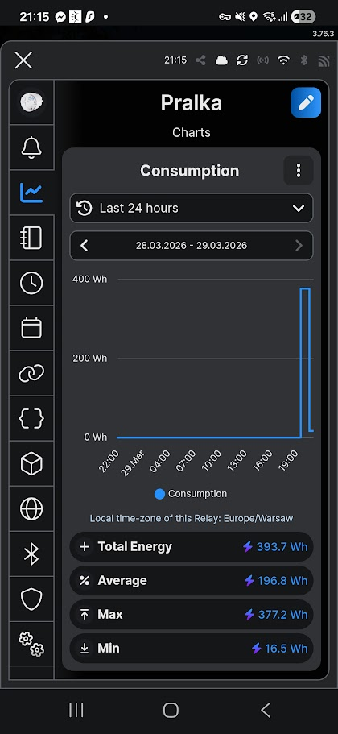{ width=30% }

# Przesyłanie i integracja danych w chmurze

## Publikacja pomiarów przez wtyczkę Shelly

Inteligentne gniazdko Shelly Plug S Gen3 pełni w architekturze rolę źródła telemetrycznego. Co około trzydzieści sekund raportuje ono bieżącą moc czynną pralki, publikując ją na brokerze MQTT w usłudze AWS IoT Core. Połączenie jest szyfrowane protokołem mTLS. Wiadomości trafiają na topic `scir/prod/washer/shelly-plug/status/switch:0`, zdefiniowany w konfiguracji infrastruktury.

Treść publikacji ma postać obiektu JSON. Akceptowane jest pole `apower` z wartością mocy w watach, zgodnie z formatem wiadomości opisanym w dokumentacji Shelly. Reguła IoT Core wzbogaca każdą wiadomość o nazwę topicu oraz znacznik czasu przyjęcia (`ingest_ts`), co ułatwia późniejsze sortowanie odczytów w chmurze.

Na odcinku między wtyczką a brokerem obowiązuje semantyka dostarczenia *at-most-once*, gdyż urządzenie Shelly nie QoS=1 w MQTT. W projekcie przyjęto, że pojedynczy utracony odczyt nie zaburza działania systemu, gdyż kolejny nadejdzie w następnym interwale raportowania.

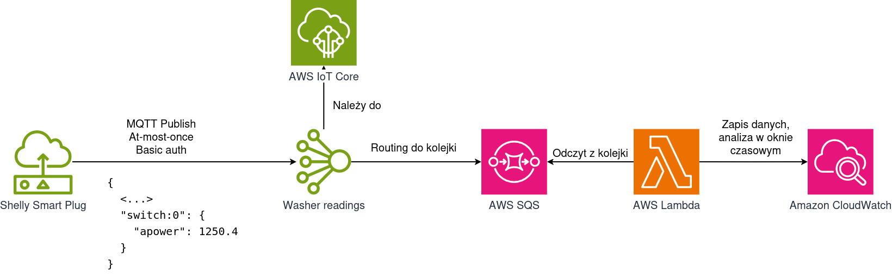{ width=100% }

## Uwierzytelnianie urządzeń

Rolę brokera MQTT pełni AWS IoT Core. Właściwy serwer pozostaje niewidoczny dla urządzeń końcowych; dostępna jest wyłącznie abstrakcja topiców oraz mechanizmy autoryzacji połączeń.

Wtyczka Shelly łączy się w trybie *basic auth* Zamiast certyfikatu klienta przesyła nazwę użytkownika równą identyfikatorowi urządzenia IoT oraz hasło wygenerowane podczas wdrażania stosu. Połączenie kierowane jest na dedykowaną konfigurację domeny AWS IoT Core, która nie wymaga okazania certyfiktu przez klienta (połączenie w dalszym ciągu jest szyfrowane). Każda próba nawiązania sesji przechodzi przez funkcję AWS Lambda odpowiadającą za uwierzytelnienie i autoryzację klienta. Autoryzator porównuje przekazane dane z oczekiwanymi wartościami; po pomyślnej weryfikacji zwraca politykę zezwalającą wyłącznie na połączenie oraz publikację na topic telemetryczny gniazdka. Tryb `mtls` pozostaje dostępny w konfiguracji infrastruktury.

Mikrokontroler ESP32 korzysta z mTLS. Posiada własny certyfikat klienta i klucz prywatny wygenerowane w IoT Core. Przypisana mu polityka zezwala na połączenie z brokerem oraz publikowanie, subskrypcję i odbiór wiadomości wyłącznie na topicu sterowania `scir/prod/washer/buzzer/events`. Urządzenie nie ma dostępu do kanału telemetrycznego gniazdka.

## Buforowanie i przetwarzanie odczytów

Reguła IoT Core `telemetry_to_sqs` przekazuje każdą odebraną wiadomość do kolejki Amazon SQS. Kolejka jest standardowa (usługa wspiera dwie rodzaje kolejek; `standard` i `fifo`), szyfrowana po stronie serwera, wyposażona w DLQ po pięciu nieudanych próbach odbioru (wiadomości z DLQ nie są dalej przetwarzane, ale pozwalają na debugowanie).

Od momentu zapisu w kolejce obowiązuje semantyka *at-least-once*: ta sama wiadomość może zostać dostarczona wielokrotnie, lecz ponowny zapis metryki o tym samym znaczniku czasu nie zmienia wyniku analizy. Funkcja Lambda `processor` (Python 3.12) jest uruchamiana dla paczek wiadomości: do dziesięciu rekordów naraz, z maksymalnym oknem grupowania sześćdziesięciu sekund. Taki układ odzwierciedla rzeczywiste tempo napływu odczytów z wtyczki.

Przepływ sterowania po opublikowaniu pomiaru wygląda następująco:

- Kolejka SQS dostarcza wiadomość do funkcji `processor`. 
- Funkcja rozpakowuje wiadomość, wydobywa pobór mocy i znacznik czasu, sortuje odczyty chronologicznie i zapisuje je metodą `PutMetricData` jako metrykę `WasherPowerReading` w przestrzeni nazw `SCIR/Washer`
- Funkcja odtwarza bieżący stan systemu (bezczynny, pranie lub buzzer) na podstawie wcześniejszych zdarzeń zapisanych w CloudWatch i ocenia, czy należy wyemitować `cycle_start` lub `cycle_end`

## Wykrywanie cyklu prania

System utrzymuje trzy stany: bezczynny, pranie oraz buzzer. Bieżący stan nie jest zapisywany w osobnej bazie; przy każdym wywołaniu funkcji `processor` lub `webhook` odtwarza się go z historii metryki `WasherEventCode` w CloudWatch (skan ostatnich dwudziestu czterech godzin). Przejścia między stanami następują wyłącznie po opublikowaniu zdarzenia sterującego: `cycle_start` prowadzi do prania, `cycle_end` do buzzera, a `buzzer_off` (w komunikatach MQTT noszone jako `buzzer_silence` z taką akcją) z powrotem do bezczynności. Odpowiadają im kody `1`, `2` i `3` zapisywane w CloudWatch.

Z bezczynnego do prania przechodzi się po emisji `cycle_start`. Funkcja `processor` generuje to zdarzenie, gdy bieżący stan to bezczynny, a w paczce odczytów pojawi się pierwsza próbka o mocy nie mniejszej niż dwa waty.

Ze stanu pranie do buzzera prowadzi `cycle_end`. Emituje je `processor`, jeśli system jest w stanie prania, a przez ostatnie dwie minuty wszystkie dostępne odczyty, w paczce bieżącej i w historii CloudWatch, nie przekraczają progu dwóch watów. Fazy cyklu o podwyższonym, lecz niskim poborze (na przykład chłodzenie po wirowaniu) same w sobie nie kończą prania, gdyż przekraczają próg; sygnał `cycle_end` pojawia się zwykle dopiero po przejściu pralki w rzeczywisty spoczynek.

Ze stanu buzzer powrót do bezczynnego następuje po `buzzer_off`, niezależnie od tego, czy pochodzi on z przycisku na płytce ESP32, czy z żądania HTTP. Samo wykrycie niskiego poboru mocy nie wycisza buzzera; wymaga to osobnej akcji użytkownika lub zdalnego polecenia.

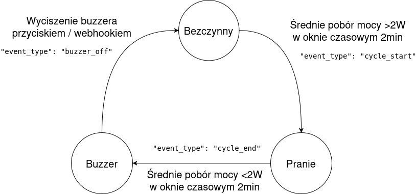{ width=70% }

## Reakcja na zakończenie prania

Wykrycie zdarzenia `cycle_end` przenosi system w stan *buzzer* i uruchamia sekwencję powiadomień. Funkcja `processor` wykonuje trzy działania w ustalonej kolejności:

- Zapisuje w CloudWatch metrykę zdarzenia o kodzie `2`
- Publikuje na topicu sterowania komunikat z polami `event_type`, `action` (wartość `buzzer_on`), `source`, `device_id` oraz `ts`. Publikacja odbywa się z QoS=1 MQTT. 
- Wysyła żądanie POST na adres webhooka Discorda; URL przechowywany jest w usłudze AWS Secrets Manager. Treść powiadomienia informuje o zakończeniu cyklu prania.

ESP32, subskrybujący topic sterowania, odbiera wiadomość i włącza buzzer. Równolegle użytkownik otrzymuje powiadomienie w aplikacji Discord na telefonie.

Zdarzenie `cycle_start` podąża tą samą ścieżką publikacji na topic sterowania i do Discorda, lecz z akcją `cycle_started` i bez włączania buzzera. Obie emisje rejestrowane są w CloudWatch, co pozwala odtworzyć pełną historię cyklu.

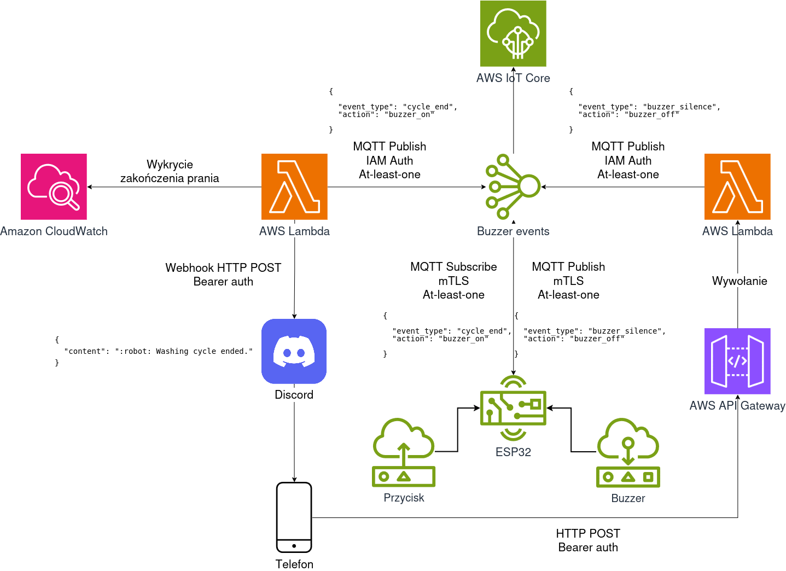{ width=100% }

{ width=50% }

## Wyciszenie buzzera

Gdy system znajduje się w stanie buzzera, użytkownik może go wyciszyć na dwa sposoby. Każdy z nich kończy się emisją `buzzer_off` i powrotem do stanu bezczynnego.

Pierwszy scenariusz to interakcja z płytką ESP32. Naciśnięcie przycisku powoduje natychmiastowe wyciszenie buzzera po stronie mikrokontrolera. Jednocześnie urządzenie publikuje na topicu sterowania wiadomość `buzzer_silence` z akcją `buzzer_off` i źródłem `esp32`. Reguła IoT Core `control_events_to_webhook` przekazuje to zdarzenie do funkcji `webhook`, która zapisuje je w CloudWatch pod kodem `3`. Ponowna publikacja na topic sterowania nie jest tu potrzebna, gdyż polecenie wyciszenia wyszło już bezpośrednio z urządzenia.

Drugi scenariusz to żądanie zdalne przez HTTP. Dowolna aplikacja zdolna do wysłania żądania POST może wywołać endpoint `POST /v1/buzzer/silence` w API Gateway, na przykład widget na ekranie głównym telefonu uruchamiający regułę w IFTTT lub Zapier. Funkcja `webhook` weryfikuje token przekazany w nagłówku `x-scir-token`; wartość oczekiwana przechowywana jest w AWS Secrets Manager. Po pomyślnym uwierzytelnieniu funkcja publikuje wiadomość `buzzer_silence` na topic sterowania, rejestruje zdarzenie w CloudWatch, a ESP32 odbiera wiadomość i wyłącza buzzer

## Przechowywanie metryk

Zgromadzone dane pomiarowe oraz wygenerowane informacje o stanie cyklu pralki przechowywane są jako szeregi czasowe w usłudze Amazon CloudWatch Metrics. Jest to rozwiązanie kompromisowe: usługa ta nie jest co do zasady wyspecjalizowaną bazą szeregów czasowych, lecz spełnia wymagania projektu przy niskich kosztach eksploatacji. Pierwotny plan przewidywał AWS Timestream for LiveAnalytics, jednak usługa ta nie jest dostępna na nowych kontach AWS. Alternatywą proponowaną przez AWS jest AWS Timestream for InfluxDB, ale ten wariant nie jest rozliczany w modelu serverless i wymaga opłacania serwera, podnosząc koszty projektu do nierozsądnego poziomu.

W produkcji wykorzystywane są dwie metryki niestandardowe w przestrzeni nazw `SCIR/Washer`. Metryka `WasherPowerReading` przechowuje kolejne odczyty mocy w watach z wymiarem `device_id`. Metryka `WasherEventCode` rejestruje zdarzenia dyskretne powiązane ze stanami: kod `1` odpowiada `cycle_start` (przejście do stanu "pranie"), kod `2` zdarzeniu `cycle_end` (przejście do stanu "buzzer"), kod `3` zdarzeniu `buzzer_off` (powrót do bezczynności). Na podstawie ostatniego z nich w kolejności czasowej odtwarzany jest bieżący stan systemu.

Funkcja `processor` zapisuje metryki w standardowej rozdzielczości CloudWatch (sześćdziesiąt sekund). Zapytania o stan cyklu korzystają z tej samej rozdzielczości przy odczycie historii. Zgodnie z polityką retencji AWS dane o rozdzielczości większej niż 60s przechowywane są przez jedynie trzy godziny, natomiast dane w rozdzielczości sześćdziesięciu sekund i więcej mają retencję czternastu dni.

# Wizualizacja danych

Do wizualizacji zebranych danych wykorzystano usługę Amazon CloudWatch Dashboards. Interfejs webowy  łączy na jednym ekranie szeregi pomiarowe, zdarzenia cyklu prania, stan kolejki telemetrycznej, aktywność funkcji serverless oraz ostatnie wpisy dziennika.

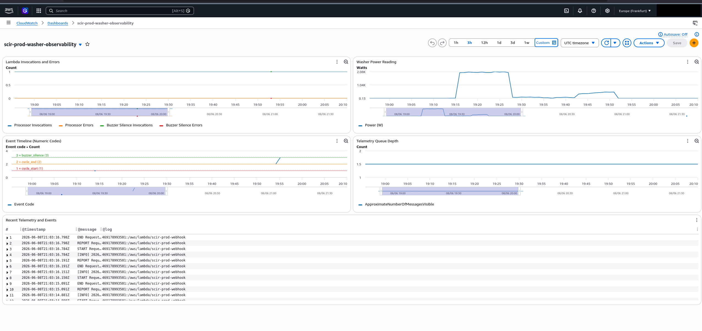{ width=100% }

## Widżety i prezentowane wartości

Układ składa się z czterech wykresów liniowych u góry oraz szerokiej tabeli logów u dołu.

Pierwszy panel, ,,Lambda Invocations and Errors'', pokazuje liczbę wywołań i błędów dwóch funkcji serverless: przetwarzającej odczyty z wtyczki (`processor`) oraz obsługującej wyciszenie buzzera (`webhook`). Pojedyncze kropki na wykresie odpowiadają paczkom odczytów lub pojedynczym żądaniom HTTP; brak błędów świadczy o prawidłowym działaniu systemu.

,,Washer Power Reading'' przedstawia pobór mocy pralki w watach na podstawie metryki `WasherPowerReading`. Na zrzucie ekranu widać typowy przebieg cyklu: faza bezczynna przy około 0,15 W, gwałtowny wzrost do około 2 kW podczas grzania wody, na koniec cyklu chwilowy wzrost użycia podczas wirowania i powrót do niskiego poboru po zakończeniu programu.

,,Event Timeline (Numeric Codes)'' wizualizuje metrykę `WasherEventCode`. Oś pionowa przyjmuje wartości od 1 do 3; poziome adnotacje oznaczają kody `1` (cycle_start, przejście do stanu prania), `2` (cycle_end, przejście do stanu buzzer) oraz `3` (buzzer_silence, powrót do bezczynności po akcji `buzzer_off`).

,,Telemetry Queue Depth'' monitoruje liczbę wiadomości oczekujących w kolejce telemetrycznej między brokerem MQTT a funkcją przetwarzającą. Wykres wskazuje, czy napływ odczytów z wtyczki jest buforowany z opóźnieniem. Stała wartość równa zero lub bardzo bliska zeru oznacza, że chmura nadąża za tempem publikacji.

Na dole ekranu znajduje się tabela ,,Recent Telemetry and Events'', zbierająca logi z funkcji `processor` i `webhook`. Widok zbiera w jednym miejscu ostatnie wpisy obu funkcji i pokazuje dla każdego rekordu moment zapisu, pełną treść oraz nazwę grupy logów, z której pochodzi. Dzięki temu w jednej tabeli widać zarówno kolejne odczyty mocy, jak i zarejestrowane zdarzenia sterujące, co ułatwia debugowanie.

## Konfiguracja i dostęp

Dashboard konfiguruje się w całości z poziomu konsoli CloudWatch. U góry ekranu wybiera się globalny zakres czasu: predefiniowany (jedna lub trzy godziny, dwanaście godzin, jeden lub trzy dni, tydzień) albo dowolny przedział kalendarzowy. Można ustawić strefę czasową (domyślnie UTC), oraz włączyć automatyczne odświeżanie albo ręcznie przeładować dane.

Standardowy dostęp wymaga zalogowania do konta AWS z uprawnieniami do odczytu CloudWatch. Dodatkowo z poziomu konsoli można wygenerować publiczny link do dashboardu; po jego udostępnieniu podgląd działa w przeglądarce bez logowania, co pozwala na łatwy dostęp z urządzenia mobilnego.

# Napotkane problemy

Debugowanie w usłudze AWS IoT Core: nawet po włączeniu logowania na poziomie `DEBUG` w całej usłudze, co powoduje zapisywanie wszystkich zdarzeń do logów w AWS CloudWatch, trudno było zidentyfikować przyczyny niektórych błędów. Przykładowo, funkcja lambda odpowiedzialna za uwierzytelnianie połączeń MQTT z gniazdka Shelly kończyła działanie sukcesem, a mimo to w logach AWS IoT Core pojawiała się wiadomość "AUTHORIZATION FAILED", bez żadnych dodatkowych informacji. Ostatecznie błąd wynikał z niepoprawnego policy zwracanego przez funkcję Lambda, ale udało się go zidentyfikować metodą prób i błędów.

Gniazdko Shelly: o ile komunikacja MQTT na płytce ESP32 była stabilna i stosunkowo prosta w implementacji, o tyle gniazdko Shelly regularnie generowało co raz to nowsze problemy. Między innymi:

- Po zastosowaniu nowej konfiguracji gniazdko uruchamiało się ponownie, jednak często po restarcie wyświetlało się jako *offline* w panelu webowym. Ponowne restarty rzadko pomagały. Taki stan utrzymywał się do godziny, blokując jakiekolwiek dalsze prace.
- Działanie i możliwości konfiguracji gniazdka były kompletnie rozbieżne z dokumentacją. Panel webowy był skonstruowany inaczej, niż twierdził producent, nie było możliwości wgrania certyfikatu x509 do obsługi mTLS (stąd decyzja o przejściu na basic auth), nie było także możliwości ustawienia QoS.
- Logi z urządzenia: po prostu ich nie było.

Decyzja o wyborze gniazdka do projektu wynikała z deklaracji producenta o wbudowanym producencie MQTT, co znacznie powinno uprościć implementację ,,sprzętowej'' strony projektu. O ile producent MQTT faktycznie był obecny, o tyle jego jakość działania była daleka od oczekiwanej.

# Wnioski

Projekt pozwolił postawić pierwsze kroki w IoT i przekonać się z czym się wiąże praca z tego typu systemami (w szczególności z jakimi trudnościami się wiąże). Posiadaliśmy już doświadczenie z AWS, niemniej implementacja przetwarzania pomiarów umożliwiła poznanie nowego kawałka chmury, z którym większość osób nie pracuje na co dzień. Dzięki świadomej konstrukcji stacku AWSa udało się ograniczyć koszt działania systemu do $<\$1$ miesięcznie, co jest akceptowalną kwotą. Pewną wartość dodaną projektu stanowi scenariusz faktycznego zastosowania - po zakończeniu przedmiotu nie zostanie ,,schowany do szuflady'', będzie stanowił *realną odpowiedź na realny problem*.
